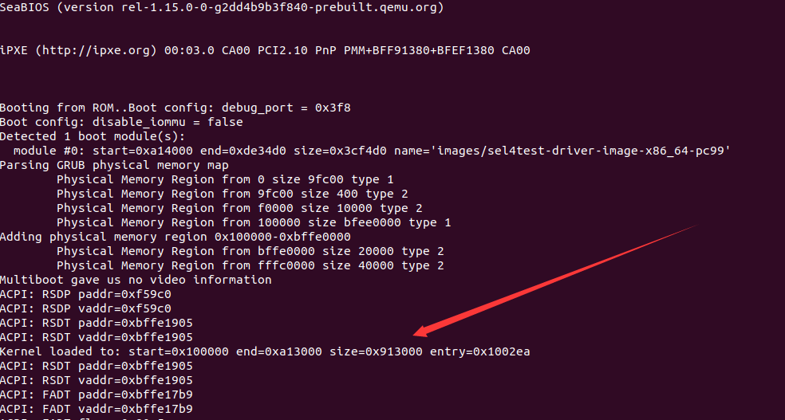
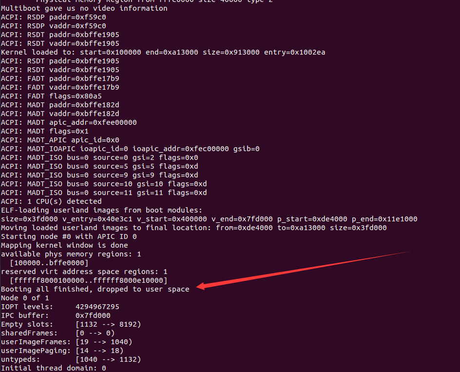
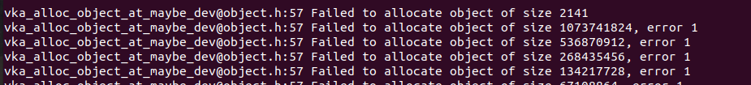
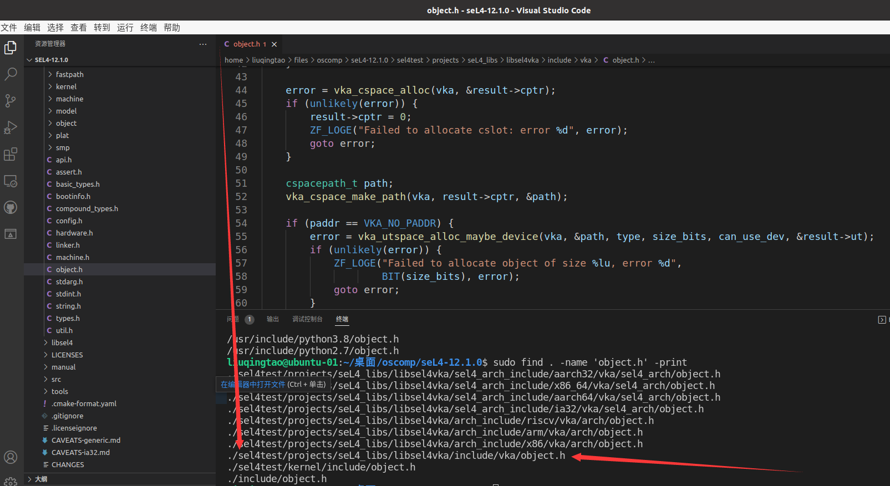

# sel4test输出及报错信息分析

按照02.28文档中的命令运行：

```
qemu-system-x86_64  -cpu Nehalem,-vme,+pdpe1gb,-xsave,-xsaveopt,-xsavec,-fsgsbase,-invpcid,+syscall,+lm,enforce -nographic -serial mon:stdio -m size=3G  -kernel images/kernel-x86_64-pc99 -initrd images/sel4test-driver-image-x86_64-pc99
```

可以看到做了初始化工作，并装载了内核：



然后系统初始化，boot阶段完成后，进入用户空间：



第一处报错信息：



在vscode中查找object.h文件，下图中红色箭头处57行是出错的函数，其他文件57行无此函数。出错函数是

```
vka_utspace_alloc_maybe_device
```



嗯找到错误源头了，现在认为是没有仔细看文档，可能缺少一些编译步骤。

下面将仔细看sel4文档。

