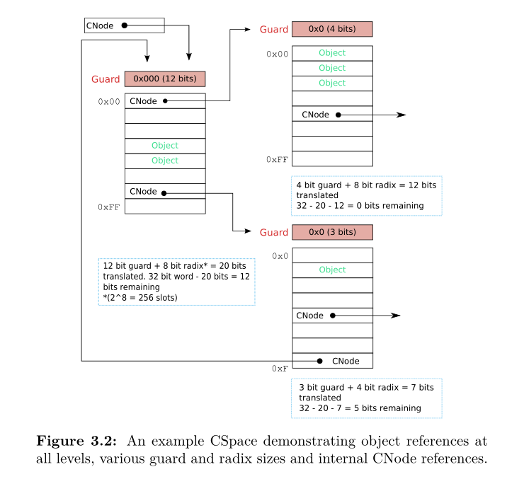

# **seL4-manual解读**

## **1.介绍**

seL4微内核是一种操作系统内核，旨在为各种应用程序域中的系统提供安全、安全、可靠的基础，它仅向应用程序提供少量服务（比如创建和管理虚拟地址空间、线程、进程间通信-IPC）。seL4大约8700行C代码，其完整性和保密性得到了证明(https://github.com/seL4/l4v)。微内核也有助于对最坏情况执行时间进行统筹分析。

manual从用户角度描述seL4内核API，首先概述seL4的设计模式，然后介绍seL4向用户空间开放的高级API。

文档描述并不保证严格符合seL4的真实行为，如有确定内核在特定环境下的精确行为的需求，应参考seL4抽象规范（seL4 abstract specification）(https://www.sel4.systems/Info/Docs/seL4-spec.pdf)，该规范是seL4内核的正式描述。

## **2.内核服务和对象**

微内核提供了有限的服务原语。更复杂的服务可以作为应用程序用这些原语实现。这样可以不增加特权模式代码以及复杂性，还能扩展功能，从而支持各种应用程序域的大量服务。
**注意，只有在内核配置为MCS（mixed-criticality system）支持时，一些服务才可用。**

seL4提供以下基本服务：

1. **Threads 线程**是支持软件运行的CPU执行的抽象;
2. **Scheduling contexts 调度上下文**(仅MCS配置下)是CPU执行时间的抽象。
3. **Address spaces 地址空间**是虚拟内存空间，每个地址空间包含一个应用程序。应用程序只能访问地址空间中的内存;
4. **Inter-process communication 通过端点的进程间通信**(IPC)允许线程使用消息传递进行通信;
5. **Reply objects 应答对象**(仅MCS配置下)用于存储一次性应答功能，在消息传递期间由接收方提供。
6. **Notifications 通知**提供了一种类似于二进制信号量的非阻塞信号机制。
7. **Device primitives 设备原语**允许将设备驱动程序实现为非特权应用程序。内核通过IPC消息导出硬件设备中断;
8. **Capability spaces 权限空间**存储对内核服务的权限(即访问权限)及其记录信息。

本章概述了这些服务，描述了用户空间应用程序如何访问内核对象，以及如何创建新的对象。
### **2.1基于权限的访问控制**

seL4微内核提供了一个基于功能的访问控制模型。访问控制控制所有内核服务;为了执行操作，应用程序必须调用其拥有的对所请求的服务具有足够访问权限的功能。有了这一点，系统可以配置为彼此隔离的软件组件，也可以通过有选择地授予特定的通信能力，在组件之间实现授权的、受控的通信。这使得软件组件隔离具有高度的安全性，因为只有那些由功能拥有明确授权的操作才被允许。

一个权限空间是一个不可伪造的令牌，它引用特定的内核对象(如线程控制块TCB)，并携带控制可能调用哪些方法的访问权限。从概念上讲，权限存在于应用程序的权限空间中;这个空间中的地址指的是一个可能包含也可能不包含权限的槽位。应用程序可以引用一种权限（例如，请求内核服务，也就是使用持有该权限的槽的地址）。这意味着，seL4权限模型是一个隔离(或分区)权限系统的实例，其中的权限由内核管理。

权限空间被实现为内核管理权限节点(Cnode)的有向图。CNode是槽（Slot）组成的表，其中每个槽可能包含更多的CNode功能。权限空间中的一个权限地址是连接Cnode中的槽位索引，形成到目标槽位的路径;[第三章](#第三章)详细讨论了CNode对象。

权限可以在权限空间内复制和移动，也可以通过IPC发送。这允许创建具有特定访问权限的应用程序，将权限委托给另一个应用程序，并将应用程序权限传递给新创建(或选定)的内核服务。此外，可以创建带有原始功能权限子集的派生权限(不可以创建比原来权限集范围更大的权限)。新创建的权限可用于部分授权。

还可以撤销（revoke）权限（capability）以撤销授权（authority）。撤销（revoke）递归地删除从被撤销的原始权限派生出来的任何权限。权限在系统中的传播由基于授权的模型控制（ [EKE08, Boy09]不知道啥东西）。

### **2.2系统调用**

seL4内核为线程之间的通信提供了消息传递服务。这种机制也用于与内核提供的服务进行通信。有一种标准的消息格式，每条消息包含许多数据，可能还包含一些权限。这些消息的结构和编码将在[第四章](#第四章)中详细描述。

线程通过在其权限空间内调用（invoke）权限来发送消息。当以这种方式调用端点、通知或应答权限（权限有端点权限endpoint capability、通知权限notification capability、应答权限reply capability等）时，消息将通过内核传输到另一个线程。当调用内核对象的其他权限时，消息将以特定于内核对象类型的方式解释为方法调用。例如，使用正确格式的消息调用线程控制块(TCB)权限将暂停目标线程。

从根本上说，我们可以认为内核提供了三个系统调用:Send、Receive和Yield。但是，还有基本的Send和Receive调用的组合和变体。一个重要的变体是Call操作，它由一个标准的Send操作和一个等待应答的Receive操作组成。回复消息总是通过一个特殊的资源来传递，而不是使用标准的IPC机制;详情请参见下面的seL4_Call()。

在内核对象上调用除端点权限和通知权限之外的方法（权限？）是通过Send或Call来完成的，这取决于调用者是(Call)否 (Send)需要内核的响应。通过使用libsel4 API提供的函数，您可以保证始终使用更合适的函数。Yield系统调用不与任何内核对象关联，并且是唯一不调用权限的操作。在MCS配置中，Wait是Receive的一个变体，它不需要提供应答对象——在非MCS配置中，Wait是Receive的同义词，因为两个调用都没有提供应答对象（也就是说，MCS配置中Receive是要提供应答对象的，非MCS配置中的Receive是不需要提供的，而Wait不管什么情况都不需要提供应答对象）。

基本的系统调用如下:

**seL4_Yield**()是唯一不需要使用权限的系统调用。它没收了调用它的线程的时间片的剩余部分，并导致内核调度器的调用。如果没有与调用者具有相同优先级的其他可运行线程，调用线程将立即用一个新的时间片调度。在MCS配置中，这种行为取决于调度上下文的状态;详见6.1.6节。

**seL4_Send**()通过指定的权限传递消息。如果调用的权限是端点权限，并且没有接收方准备立即接收消息，则发送线程将阻塞，直到可以传递消息为止。接收对象不会返回错误代码或响应（官网上IPC部分说过这样能避免反向通道 back channel）。

**seL4_Recv**() (" receive ")用于线程通过端点或通知接收消息。如果没有发送方或通知处于挂起状态，则调用方将阻塞，直到可以传递消息或通知为止。此系统调用仅在端点Endpoint权限或通知Notification权限上才起作用，当尝试使用其他功能类型时将引发错误(参见6.2节)。在MCS配置中，Receive接受一个应答权限(应答对象的权限)作为参数。

其余的系统调用是seL4_Send()和seL4_Recv()的变体和组合，可以有效地适应系统编程中的常见用例。

**seL4_NBSend**()在端点上执行轮询发送。如果消息不能立即传递，也就是说，目标端点上没有等待接收者，则消息将被静默地丢弃。发送线程继续执行。与seL4_Send()一样，不会返回错误代码或响应。

**seL4_NBRecv**()被线程用来检查通知对象上挂起的信号或端点上挂起的消息，而不会阻塞。此系统调用仅对端点权限和通知权限起作用（类似普通Recv），当尝试使用其他功能类型时将引发错误(参见6.2节)。

**seL4_Call**()结合了seL4_Send()和seL4_Recv()，并有一些重要的区别。调用将阻塞发送线程，直到它的消息被传递并收到回复消息。当调用内核服务而不是端点的权限时，使用seL4_Call()允许内核通过应答消息返回错误代码或其他响应。当发送的消息通过端点传递到另一个线程时，内核执行与seL4_Send()相同的操作。接下来发生什么取决于内核配置。对于MCS配置，内核然后更新接收方提供的应答对象。应答对象是跟踪应答消息的容器，用于发送应答消息并唤醒调用者。在非MCS配置中，内核会在接收端TCB的一个专用插槽（Slot）中存储一个特殊的应答权限。此应答权限是发送应答消息并唤醒调用者的单一使用权限，这意味着一旦调用该应答消息，内核就会使其失效。对于这两个变体，在调用应答对象的权限之前，调用线程都会被阻塞。更多信息请参见4.2.4节。

**seL4_Reply**()用于响应seL4_Call()，方法是调用应答权限，这个应答权限是由seL4_Call()系统调用生成并存储在应答线程TCB的专用槽中的。它具有与使用seL4_Send()调用应答权限完全相同的行为，这在4.2.4节中有描述。

**seL4_ReplyRecv**()由seL4_Reply()和seL4_Recv()组合而成。它的存在主要是为了提高效率，也就是说，通常情况下，响应一个请求并等待下一个请求可以在单个内核系统调用中执行，而不是两个。从应答到接收阶段的转换也是原子性的。

**seL4_Wait**()类似于seL4_Recv();在非MCS配置上，它们实际上是同义的。在MCS配置中，当不需要应答时使用seL4_Wait()。与seL4_Recv()不同，seL4_Wait()不接受应答权限。

**seL4_NBWait**()(仅MCS)被线程用于通过端点或通知轮询消息。如果没有等待的发送方或通知，系统调用将立即返回。

**seL4_NBSendWait**()(仅MCS)将seL4_NBSend()和seL4_Wait()组合成一个原子系统调用。

**seL4_NBSendRecv**()(仅MCS)将seL4_NBSend()和seL4_Recv()组合成一个原子系统调用。

### **2.3内核对象**

本节简要概述内核实现的对象类型，应用程序可以调用这些对象的实例（也成为对象）。这些对象的接口构成内核本身的接口。内核服务的创建和使用是通过创建、操作和组合这些内核对象来实现的。

**CNodes**(见第三章)存储权限，赋予线程调用特定对象方法的权限。每个CNode都有固定数量的插槽（Slot），总是2的指数幂，这取决于CNode是在什么时候创建的。插槽可以是空的，也可以包含一个权限的。

**Thread Control Blocks**线程控制块(TCBs;(参见第6章)在seL4中表示一个执行的线程。线程是调度、阻塞、解除阻塞等执行的单元，这取决于应用程序与其他线程的交互。

**Scheduling contexts**(仅MCS)调度上下文(见第6章)在seL4中表示CPU时间。用户可以从非类型化（untyped）对象创建调度上下文，但是在创建时调度上下文是空的，不代表任何时间。最初，每个节点都有一个SchedControl权限，它允许使用参数填充调度上下文，这些参数需要和优先级控制线程（ priority control
thread）对CPU时间的访问结合。

**Endpoints**端点(参见第4章)促进线程之间的消息传递通信。IPC是同步的:试图在端点上发送或接收消息的线程会阻塞，直到消息能够被传递。这意味着，只有当发送方和接收方在端点汇合时，才会发生消息传递，并且内核可以使用单个副本传递消息(或者仅使用寄存器，不复制短的消息)。

**Reply objects**回复对象(仅MCS)(见第4章)跟踪调度上下文，并为一次性回复权限提供一个容器。它们由seL4_Recv()提供。

**Notification Objects**通知对象(见第5章)提供了一个简单的信令机制。Notification是一个字大小的标志数组，每个标志的行为都类似于二进制信号量。其上操作有：seL4_Signal（）在单个操作中发送全体标志集的子集；seL4_Poll（）轮询检查任何标志；seL4_Wait（）在收到信号前阻塞。通知权限可以是仅信号（signal-only）或仅等待（ wait-only）。

**Virtual Address Space Objects**虚拟地址空间对象(见第七章)，用于为一个或多个线程构造一个虚拟地址空间(又称VSpace)。这些对象在很大程度上直接对应于硬件，因此是依赖于体系结构的。内核还包括ASID Pool和ASID Control对象，用于跟踪地址空间的状态。

**Interrupt Objects**中断对象(见第8章)使应用程序能够接收并确认来自硬件设备的中断。最初，IRQControl有一个权限，它允许创建IRQHandler权限。一个IRQHandler权限允许管理与特定设备关联的特定中断源。它被委派给设备驱动程序以访问中断源。
IRQHandler允许线程等待并确认单个中断。

**Untyped Memory**无类型内存(参见2.4节)是seL4内核中内存分配的基础。无类型内存权限有一个单一的方法，它允许创建新的内核对象。如果方法成功，调用线程将获得对新创建对象的权限的访问权。此外，无类型内存对象可以被分成一组较小的无类型内存对象，允许委托部分(或全部)系统内存。我们将在下面的章节中讨论内存管理。

### **2.4内核内存分配**

seL4微内核不动态地为内核对象分配内存。相反，对象必须通过Untyped memory权限从应用程序控制的内存区域显式创建。为了创建新对象，应用程序必须具有对内存的显式权限(通过Untyped memory权限获得)，而所有对象在创建后都将消耗固定数量的内存。这些机制可用于精确控制应用程序可用物理内存的特定数量，包括能够在应用程序或设备之间强制物理内存访问的隔离。除了那些由硬件（对虚拟ASID的处理强加了固定数量的地址空间。这个限制将在seL4的未来版本中消除）决定的限制外，内核中没有任何的资源限制，因此可以避免许多通过资源耗尽而导致的Dos攻击。

在引导时，seL4预先分配内核本身所需的内存，包括代码、数据和堆栈部分(seL4是一个单一的内核堆栈操作系统)。然后创建一个初始用户线程(带有适当的地址和权限空间)。然后内核将所有剩余的内存以Untyped memory权限的形式交给初始线程，并将一些额外的权限交给内核对象(引导初始线程需要这些功能)。然后可以使用seL4_Untyped_Retype()方法将这些Untyped Memory区域分割成更小的区域或其他内核对象;创建的对象被称为原始Untyped memory对象的子对象。

使用seL4_Untyped_Retype()创建对象的用户级应用程序接受对结果对象的完全权限。然后，它可以将其对该对象拥有的全部或部分权限委托给它的一个或多个客户端。

Untyped memory对象表示两种不同类型的内存:通用内存(general purpose memory)或设备内存(Device memory)。通用内存可以untyped为任何其他对象类型，并用于内核提供的Untyped memory上的任何操作。设备内存覆盖硬件平台确定的为设备预留的内存区域，内核通过以下方式限制这些对象的使用:

+ 设备无类型对象(Device untyped objects)只能retyped为帧或其他无类型对象;例如，开发人员不能从设备内存中创建端点。

+ 从设备无类型对象(device untyped objects )重新retyped的帧对象不能设置为线程IPC缓冲区，或用于创建ASID池。

子untyped对象的类型属性(无论它是通用内存还是设备内存)继承自其父untyped对象。也就是说，untyped设备对象的任何子对象也将是untyped设备对象。开发人员不能更改untyped对象的类型属性。

#### **2.4.1内存重用**

到目前为止所描述的模型足以让应用程序分配内核对象、在客户端应用程序之间分配权限，并获得这些对象提供的各种内核服务。这对于简单的静态系统配置来说就足够了。

seL4内核还允许重用(reuse)无类型内存(Untyped Memory)区域。只有当没有悬空引用(即权限)留给该内存中的对象时，重用一个区域的内存才是允许的。内核会跟踪派生权限(capability derivations)，即由方法seL4_Untyped_Retype()、seL4_CNode_Mint()、seL4_CNode_Copy()和seL4_CNode_Mutate()生成的子进程。

这样生成的树结构称为权限派生树(capability derivation tree，CDT。尽管CDT在概念上是一个独立的数据结构，但它是作为CNode对象的一部分实现的，因此不需要额外的内核元数据)。例如，当用户通过retype untyped memory创建新的内核对象时，新创建的权限将作为untyped memory 权限的子权限插入到CDT中。

对于每个Untyped Memory区域，内核保留一个水印，记录该区域之前被分配了多少空间。当用户请求内核在非类型内存区域中创建新对象时，内核将执行两种操作之一:如果该区域中已经分配了对象，内核将在当前水印级别上分配新对象，并修改水印。如果先前在区域中分配的所有对象都已删除，内核将重置水印，并再次从区域的开始分配新对象。

最后，CNode对象提供的seL4_CNode_Revoke()方法销毁了从参数权限（一个权限类型？之前没见过）派生的所有权限。撤销内核对象的最后一个权限会触发对现在未引用的对象的销毁操作。这只会清除它、其他对象和内核之间的所有的内核依赖关系。

通过对untyped memory对象的原始权限调用seL4_CNode_Revoke()，用户删除所有untyped memory对象的子对象——也就是说，所有指向untyped memory区域对象的权限。因此，在此调用之后，对untyped memory区域内的任何对象都没有了有效的引用，该区域可以安全地retyped和reused。

#### **2.4.2对象大小总结**

在retype untyped memory时，了解对象将需要多少内存是有用的。对象大小在libsel4中定义。

注意，Cnodes、SchedContexts调度上下文(仅MCS)和Untyped Objects都有变量大小。当将无类型内存retype到CNodes或SchedContexts，或者将一个untyped Object分解为更小的untype Object时，seL4_Untyped_Retype()的size_bits参数被用来指定结果对象的大小。对于所有其他对象类型，大小是固定的，seL4_Untyped_Retype()的size_bits参数被忽略。
| 类型 | size_bits参数含义 | 对象字节大小 |
|--|-------|---|
|CNode| slot槽位数的2对数 | 2^size_bits *2^seL4_SlotBits(seL4_SlotBits在32位机器上是4，在64位机器上是5)|
|SchedContext调度上下文(仅MCS)|字节的2对数|2^size_bits|
|Untyped|字节的2对数|2^size_bits|

对seL4_Untyped_Retype()的单个调用可以将单个Untyped Object retype为多个对象。要创建的对象的数量由它的num_objects参数指定。所有创建的对象必须是由type参数指定的相同类型。对于大小可变的对象，每个对象也必须具有相同的大小。如果所需内存区域的大小(通过对象大小乘以num_objects计算)大于Untyped object的剩余未分配内存，则会导致错误。

## **3.权限空间**

回想一下，在第2.1节中，seL4实现了一个基于权限的访问控制模型。每个用户空间线程都有一个相关的权限空间(CSpace)，它包含线程拥有的权限，从而控制线程可以访问哪些资源。

回想一下，权限驻留在称为Cnode的内核管理对象中。CNode是一个槽组成的表，每个槽可以包含一个权限。这可能包括进一步的Cnode权限，形成一个有向图。从概念上讲，一个线程的CSpace是有向图中从CNode权限开始可到达的部分，CNode权限是它的CSpace的根。

CSpace地址指的是一个单独的槽位(在CSpace中的某些CNode中)，它可能包含也可能不包含某个权限。线程在它们的Cspace中引用权限(例如，当进行系统调用时)，使用存放该功能的槽的地址。CSpace中的地址是CNode权限的索引的连接，形成了到目的槽的路径;我们将在第3.3节进一步讨论这个问题。

回想一下，权限可以在cspace中复制和移动，也可以在消息中发送(消息发送将在4.2.2节详细描述)。此外，新权限可以从旧权限的权利子集中创建出来。回想一下，在第2.4.1节中，seL4维护了一个权限派生树(CDT)，它在其中跟踪这些复制的权限与原始权限之间的关系。revoke方法删除所有从选定权限派生出来的权限(在所有Cspace中)。这种机制可以被服务器用来恢复对客户端可用的对象的唯一权限，也可以被无类型化内存（untyped memory）的管理者用来销毁内存中的对象，以便retype。

seL4要求程序员从用户空间管理所有内核数据结构，包括CSpaces。这意味着用户空间程序员要负责构造cspace以及在cspace中对权限进行寻址。本章首先讨论权限和CSpace管理，然后讨论如何在CSpace中处理权限，也就是说，应用程序在调用方法时如何在CSpace中引用单个权限的。

### **3.1权限和CSpace管理**

#### **3.1.1CSpace创建**

cspace是通过创建和操作CNode对象来创建的。当创建一个CNode时，用户必须指定它将拥有的插槽数量，这决定了它将使用的内存数量。每个插槽需要2^seL4_SlotBits字节的物理内存，并且具有刚好容纳一个权限的容量。在32位体系结构上是16字节，在64位体系结构上是32字节。像任何其他对象一样，CNode必须通过调用seL4_Untyped_Retype()来创建一个适当数量的无类型内存(参见2.4.2节)。因此，调用者必须能够获得足够的无类型内存，以及现有cnode中可用的足够的空闲权限槽，以便seL4_Untyped_Retype()调用能够成功。

#### **3.1.2CNode方法**

权限主要是通过调用CNode方法来管理的。cnode支持以下方法:

**seL4_CNode_Mint**()在指定的CNode槽位上从现有的权限创建一个新的权限。新创建的权限可能比原来的权限拥有更少的权限和不同的guard（保护位）(参见章节3.3.1)。seL4_CNode_Mint()还可以从一个未badged（标记）的权限创建一个标记的权限(参见4.2.1节)。

**seL4_CNode_Copy**()类似于seL4_CNode_Mint()，但是新创建的权限具有与原始功能相同的标记和守卫。

**seL4_CNode_Move**()在两个指定的权限槽之间移动权限。您不能将一个权限移动到它当前所在的槽位。

**seL4_CNode_Mutate**()可以像seL4_CNode_Move()一样移动一个权限，也可以像seL4_CNode_Mint()一样减少它的权限，尽管不保留原始副本。

**seL4_CNode_Rotate**()在三个指定的权限槽之间移动两个权限。它本质上是两个seL4_CNode_Move()调用:一个从第二个指定槽位到第一个，一个从第三个槽到第二个。指定的第一个和第三个槽可能相同，在这种情况下，第一个槽中的权限将与第二个槽中的权限交换。方法是具有原子性的（要不不都不移动，要不都移动）。

**seL4_CNode_Delete**()从指定的槽位删除一个权限。

**seL4_CNode_Revoke**()相当于对指定权限的每个派生子函数调用seL4_CNode_Delete()。它对权限本身没有影响，除非是在章节3.2中描述的非常具体的情况下。

**seL4_CNode_SaveCaller**()将当前线程的内核生成的reply应答权限从创建它的特殊TCB槽移动到指定的CSpace槽中(仅适用于非mcs)。

**sel4_cnode_cancelbadgedsend**()取消使用相同标记和对象作为指定权限的未完成的发送行为。

#### **3.1.3新retyped对象的权限**

当使用seL4_Untyped_Retype()将untyped memory retype为对象时，对新retyped的对象的权限被放置在由其root、node_index和node_depth参数指定的CNode中的连续槽中。参数node_offset指定CNode的索引，第一个权限将被放置在该索引处。num_objects参数指定要创建的权限(以及对象)的数量。所有槽位必须为空，否则将导致错误。所有产生的权限都将放在同一个CNode中。

#### **3.1.4权限（capabitily）的权限**

如前所述，一些权限类型具有与之关联的访问权限。目前，访问权限与endpoint(见第4章)、Notifications(见第5章)、Pages(见第7章)和reply(见第4章)的权限相关联。与权限相关联的访问权限决定了可以调用的方法。seL4支持四种访问权限:Read、Write、Grant和GrantReply。Read, Write和Grant互相正交。Grantreply是Grant的一种较弱的形式，例如，如果你已经拥有了Grant，是否拥有Grantreply是无所谓的。每一项权限的含义都是相对于各种对象类型进行解释的，如下表所示。

|对象类型|Read|Write|Grant|GrantReply|
|---|---|---|---|---|
|Endpoint|Recv|Send|Send capabilities|Sending reply capabilities|
|Notification|Wait|Signal|N/A|N/A|
|Page|Mapping the page readable|Mapping the page writable|N/A|N/A|
|Reply|N/A|N/A|Sending any capabilities in reply message|N/A|

#### **3.1.5权限派生树**

如2.4.1节所述，seL4在权限派生树中跟踪派生出的子权限。

可以使用各种方法创建派生权限，比如seL4_CNode_Copy()或seL4_CNode_Mint()。并不是所有的权限都支持派生。通常，只有原始权限支持派生调用，但也有例外。下表总结了各种权限类型要派生权限必须满足的条件，以及在每种情况下如何报告权限派生失败。**没有列出的权限类型可以派生一次**。

|权限类型|派生条件|派生失败报错码|
|---|---|---|
|Reply权限|不能|依赖于系统调用|
|IRQControl权限|不能|依赖于系统调用|
|Untyped权限|不能有子权限(第3.2节)|seL4_RevokeFirst|
|Page Table权限|必须被映射|seL4_IllegalOperation|
|Page Directory权限|必须被映射|seL4_IllegalOperation|
|IO Page Table (IA-32only)权限|必须被映射|seL4_IllegalOperation|

上图展示了一个权限派生树例子，该树演示了一个标准场景:顶层是一个大型的Untyped权限，第二层将此权限分为两个区域，由它们自己的Untyped权限覆盖，它们都是第一级的子级。左边的第三个级别是2级Untyped权限的副本。当复制Untyped权限时，总是会产生孩子，而不是兄弟姐妹。在这个场景中，Untyped权限被type到两个单独的对象中，在级别4上创建两个权限，这两个功能都是各自对象的原始权限，两者都是创建它们的Untyped权限的子级。

普通的原始权限可以有一个级别的派生权限。这些派生权限的进一步复制将创建兄弟级权限，在本例中在第5级。对于端点和通知（Endpoint和Notification）权限，这个方案有一个例外——它们通过标记支持一个额外的深度层。原始的Endpoint或Notification权限将被取消标记。使用mint方法，可以创建一个带有特定标记的权限副本(参见章节4.2.1，章节5.1)。这个新的、标记到相同对象的权限被视为原始权限(“原始标记的端点权限”)，并像其他权限一样支持一层派生的子权限。

### **3.2删除和撤销**

seL4中的权限可以被删除和撤销。这两种方法主要影响权限，但它们可能对系统中的对象产生副作用，删除或撤销会导致对象的最后一个权限被销毁。

如上所述，seL4_CNode_Delete()将从指定的CNode槽中删除一个权限。但是，如果被删除的权限是一个对象的最后一个typed权限，那么这个对象现在将被内核销毁，清理所有剩余的内核引用，并为重用准备内存。

如果要销毁的对象是一个权限容器，即TCB或CNode，则销毁过程将在销毁容器之前删除容器中持有的每个权限。如果所包含的权限是最后的权限，这可能导致进一步的对象的破坏。

seL4_CNode_Revoke()方法将seL4_CNode_Delete()指定权限的所有CDT子节点，但功能本身将保持不变。如果被撤销的子权限是对象的最后一个功能，则触发适当的销毁操作。

注意:seL4_CNode_Revoke()在两种特定情况下只能部分完成。第一个是包含执行撤销revode操作的线程的TCB的最后一个功能(或TCB本身的最后一个功能)的CNode在撤销操作后被删除。在这种情况下，执行撤销的线程在撤销期间被销毁，而且撤销没有完成。第二种情况是，包含作为撤销目标的权限的存储在撤销中被删除。在这种情况下，在操作期间将删除执行撤销的权限，并且操作中途停止。这两种情况可以且应该在用户级通过结构来避免。

注意，对于页表page tables和页目录page directories，seL4_CNode_Revoke()不会撤销映射到地址空间的帧权限。它们只会从空间中被取消映射。

### **3.3 CSpace寻址**

当执行系统调用时，线程通过在其CSpace中给出一个地址来指定内核要调用的权限。这个地址指的是调用者的CSpace中包含要调用的权限的特定槽。

Cspace的设计允许稀疏性，并且查找权限地址的过程必须是高效的。因此，Cspace被实现为被保护的页表。

正如前面所解释的，CSpace是一个CNode对象的有向图，每个CNode是一个槽组成的表，其中每个槽可以是空的，或者包含一个权限，它可以引用另一个CNode。回想一下，在2.3节中，CNode的槽数必须是2的幂。一个CNode有一个基数，它的大小是2的幂次。也就是说，如果一个CNode有2^k个插槽，它的基数将是k。内核将每个线程的CSpace的根CNode的权限存储在线程的TCB中。从概念上讲，CNode权限不仅存储了对它所引用的CNode的引用，而且还携带了一个guard保护值，在章节3.3.1中解释了这一点。

#### **3.3.1权限地址查找**

与虚拟内存地址一样，权限地址也是一个整数。权限地址不是指物理内存的位置(就像虚拟内存地址那样)，而是指权限插槽。当查找用户空间线程提供的权限地址时，内核首先咨询线程TCB中的CNode权限，TCB定义了线程CSpace的根。然后将CNode的guard保护值与权限地址的有效位进行比较。如果两个值不同，则查找失败。否则，内核然后使用权限地址的下一个最重要的基数位作为CNode权限所指向的CNode的索引。由后面这些基数位标识的槽可能包含另一个CNode权限或包含其他东西(不包含任何东西)。如果s包含一个CNode权限c，并且权限地址中还有剩余的位(在基数位之后)还没有被转换，那么查找过程将重复进行，从CNode权限c开始并使用权限地址的这些剩余的位。否则，查找过程成功终止;权限地址指的是权限槽位。

图3.2演示了一个有效的CSpace。

+ 左边的是一个顶级CNode对象，有12bit保护位还有256个槽位（即8bit的Node内的地址/偏移）

+ 这个顶级的CNode带有对对象的直接引用（绿色Object）。

+ 这个顶级CNode还带有俩个二级CNode的引用。

+ 俩个二级CNode有不同的保护位和槽数（上面的二级CNode有4bit的保护位，256个槽位即8bit的Node内地址/偏移，此时它已经没有了剩余的bit待解析；下面的二级CNode有3bit的保护位，16个槽位，4bit的Node内地址/偏移，此时它的地址还有5bit待解析）

+ 下面的二级CNode带有顶级CNode的引用，除此之外还有另一个CNode的引用（其实还有一个object的直接引用）。

#### **3.3.2权限寻址**

权限地址存储在CPointer(缩写为CPTR)中，CPointer是一个无符号整型变量。功能按照上面描述的翻译算法来处理。两种特殊情况涉及到对CNode功能本身的寻址和对一系列权限槽的寻址。

回想一下，上面描述的转换算法将遍历CNode权限同时还有待翻译的bit位。因此，为了定位一个可能是CNode权限的权限，用户不仅必须提供权限地址，而且还必须指定要转换的权限地址的最大位数，称为深度限制。当CPointer与深度depth配对时，只有它的depth个最低有效位被用于寻址。

某些方法，如seL4_Untyped_Retype()，要求用户提供一系列的权限槽。这是通过提供一个起始权限地址来实现的，它引用范围内的第一个槽位，同时提供一个窗口大小参数，指定范围内的槽位数量(在基槽位之后有连续的地址)。

### **3.4寻址失败类型和描述**

当权限查找失败时，失败的描述将被提供给调用线程或线程的IPC缓冲区中的异常处理程序。描述的格式总是相同的，但根据错误发生的方式，IPC缓冲区中的偏移量可能不同。。

#### **3.4.1无效root** 

CSpace CPTR root(在其中查找一个权限)是无效的。例如，该权限不是CNode权限。

|数据|含义|
|---|---|
|Offset + 0|seL4_InvalidRoot|

#### **3.4.2权限缺失（Missing）** 

调用的权限缺失（Missing），或者没有足够的权限。

|数据|含义|
|---|---|
|Offset + 0|seL4_MissingCapability|
|Offset + seL4_CapFault_BitsLeft| Bits left|

#### **3.4.3深度（depth）不匹配** 

当解析一个权限时，会遍历一个CNode，该CNode解析的bit数比在CPTR中剩下的要解码的bit数要多，或者遇到一个非CNode权限，而仍然有bit需要查找。

|数据|含义|
|---|---|
|Offset + 0|seL4_DepthMismatch|
|Offset + seL4_CapFault_BitsLeft|仍待解码的CPTR位|
|Offset + seL4_CapFault_DepthMismatch_BitsFound|解析当前CNode被遍历的位|

#### **3.4.4保护位（Guard）不匹配** 

当解析一个权限时，CNode的保护位大小大于剩余的位数，或者CNode的保护位与正在解析的CPTR的bit不匹配。

|数据|含义|
|---|---|
|Offset + 0|seL4_GuardMismatch|
|Offset + seL4_CapFault_BitsLeft|仍待解码的CPTR位|
|Offset + seL4_CapFault_GuardMismatch_GuardFound|CNode的保护位|
|Offset + seL4_CapFault_GuardMismatch_BitsFound|CNode保护位的大小（size）|

## **4.消息传递（IPC）**

seL4微内核为线程之间的通信提供了消息传递IPC机制。同样的机制也用于与内核提供的服务进行通信。消息是通过调用内核对象的权限来发送的。发送到端点Endpoints的消息的目的地是其他线程，而发送到其他对象的消息则由内核处理。本章描述了常用的消息格式、endpints端点，以及如何在应用程序之间使用它们进行通信。

### **4.1消息寄存器**

每条消息包含一些消息字和一些可选的权限。通过将消息字放入线程的消息寄存器来向线程发送消息字或从线程接收消息字。消息寄存器被编号，前几个消息寄存器使用物理CPU寄存器实现，而其余的消息寄存器由一个称为IPC缓冲区的固定内存区域支持。这种设计的原因是效率:非常短的消息不需要使用内存。IPC缓冲区被分配给调用线程(参见章节6.1和章节10.3.7.11)。

每个IPC消息也有一个tag标记(seL4_MessageInfo_t结构体)。标记由四个字段组成:label标签、消息长度、权限数量(extraCaps字段)和capsUnwrapped字段。消息长度和权限数量决定了发送线程希望传输的消息寄存器和权限的数量，或者决定了实际传输过来的消息寄存器和权限的数量。label标签不经内核解释，并作为消息的第一个数据未经修改地传递。例如，label标签可以用来指定所请求的操作。capsUnwrapped字段仅在接收端使用，用于指示接收权限的方式。它将在4.2.2节中描述。

|类型|名字|描述|
|---|---|---|
|seL4_MessageInfo_t|tag|信息tag标签|
|seL4_Word[]|msg|消息内容|
|seL4_Word|userData|结构体的基址，由支持用户库使用|
|seL4_CPtr|caps|要传输的权限|
|seL4_CapData_t|badges|endpoint端点权限接收到的标记badge|
|seL4_CPtr|receiveCNode|CPTR到CNode，从中找到接收槽位|
|seL4_CPtr|receiveIndex|CPTR到相对于receiveCNode的接收槽位|
|seL4_Word|receiveDepth|要使用的receiveIndex的bit数|
|**注意：标记badge和权限是结构体的同一个字段，一个用于发送，一个用于接收**|

内核假设IPC缓冲区包含上表中定义的seL4_IPCBuffer类型的结构。内核使用尽可能多的物理寄存器来传输IPC消息。当传输的参数超过可用的物理消息寄存器时，内核开始使用IPC缓冲区的msg字段来传输参数。但是，它在这个数组中也为物理消息寄存器留下了空间。例如，如果一个IPC传输或内核对象调用需要4个消息寄存器(在这个体系结构上只有2个物理消息寄存器可用)那么参数1和2将通过消息寄存器传递，参数3和4将在msg[2]和msg[3]中。这允许用户级对象调用存根在需要时将物理寄存器中传递的参数复制到msg数组中剩余的空间中。tag字段的情况类似。在seL4_IPCBuffer结构体中有这个字段的空间，内核会忽略它。用户级存根可能希望从其CPU寄存器复制tag字段，尽管内核提供的用户级存根不会这样做。

### **4.2端点Endpoints**

端点允许在两个线程之间传输少量的数据和权限(即IPC缓冲区)。端点对象是使用第2.2节中描述的seL4系统调用直接调用的。

IPC端点使用集合模型，因此是同步和阻塞的。端点对象可以对发送或接收的线程进行排队。如果没有接收方就绪，执行seL4_Send()或seL4_Call()系统调用的线程将在队列中等待第一个可用的接收方。同样，如果没有发送方准备好，执行seL4_Recv()系统调用或seL4_ReplyRecv()的后半部分的线程将等待第一个可用的发送方。

在没有写入权限的情况下尝试send或call将失败并返回错误。在send的情况下，错误被忽略(内核不允许回复)。因此，没有办法知道发送是否已经失败，因为没有权限。另一方面，使用没有Read权限的端点功能调用seL4_Recv()将引发错误，请参见6.2节。这是因为如果不这样做，错误消息将无法与通过端点从另一个线程接收到的正常消息区分开来。

#### **4.2.1端点标记badges**

端点权限可以mint一个附加了标记的新端点权限，这个标记是由mint操作调用方决定的。当消息使用标记权限发送到端点时，该标记被传输到接收线程的标记寄存器。

标记为0的端点权限被称为无标记的。这样的权限可以被seL4_CNode_Mutate()或seL4_CNode_Mint()标记。带有标记的端点权限不能被取消标记、重新标记或用于创建带有不同标记的子权限。

在32位平台上，只有低28位的badge标记可用。内核将默认高4位。在64位平台上，badge的64位全部有效。

#### **4.2.2权限传输**

如果发送线程调用的端点权限具有Grant权限，接收方能从消息中接收到权限cap。使用没有Grant权限的端点权限发送权限仅会传输原始消息。

在消息中发送的权限会在发送线程的IPC缓冲区的caps字段中指定。该数组中的每个条目在发送线程的能力空间中被解释为CPTR。要发送的能力的数量在消息标记的extraCaps字段中指定。

接收方指定接收的槽位，IPC缓冲区中有（within）三个字段:receiveCNode、receiveIndex和receiveDepth。这些字段分别指定根CNode、权限地址和要解析的位数，以找到放置权限的槽位。权限寻址在章节3.3.2中描述。

请注意，接收线程可以只指定一个接收槽，而发送线程可以在消息中包含多个权限。包含多个权限的消息可能由内核对象解释。在消息中的一些额外功能可以被unwrapped的情况下，它们也可能被发送给接收线程。

如果第n个能力指的是端点的消息通过消息发送,能力是打开:它的徽章是放在第n个接收机位置的徽章数组,和内核设置第n个点(从最低有效计数)capsUnwrapped消息的字段标签。能力本身不会被传输，因此接收槽可以用于另一个能力。