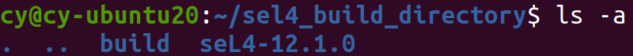
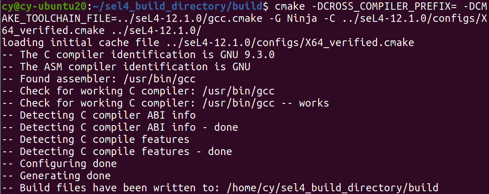
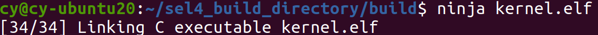
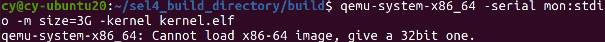
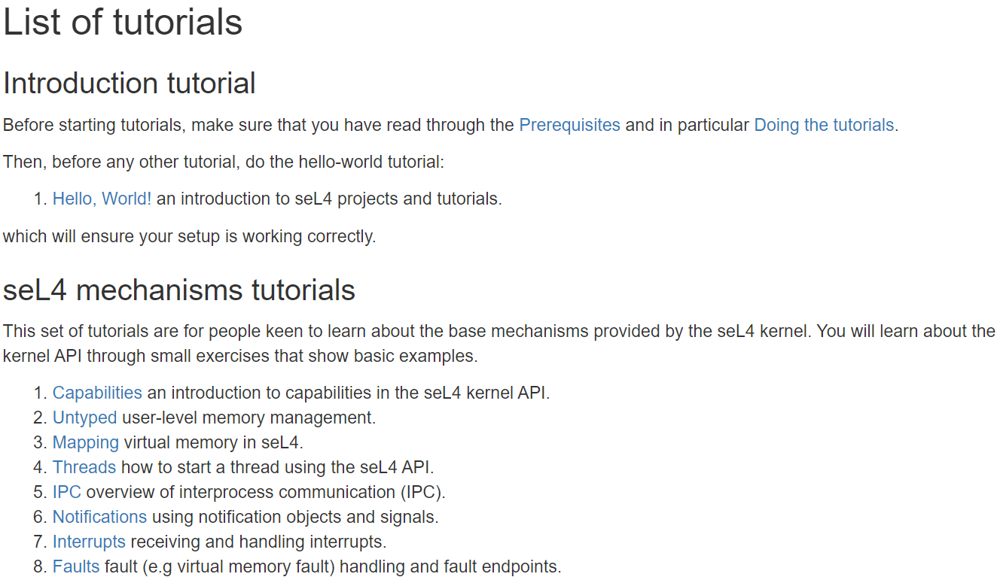

# 根据官方教程单独构建了一下seL4内核 [Stand-alone seL4 builds](https://docs.sel4.systems/projects/buildsystem/standalone.html)
1.从[下载seL4 12.1.0源码](https://github.com/seL4/seL4/releases/tag/12.1.0)

2.新建sel4_build_directory作为根目录，放入seL4-12.1.0源码，同时新建build目录用于构建内核，目录结构如下

3.进入build目录，执行cmake命令
`cmake -DCROSS_COMPILER_PREFIX= -DCMAKE_TOOLCHAIN_FILE=../seL4-12.1.0/gcc.cmake -G Ninja -C ../seL4-12.1.0/configs/X64_verified.cmake ../seL4-12.1.0/`

4.编译内核

5.尝试用qemu跑一下内核

出现问题，查了一下[原因](https://forum.osdev.org/viewtopic.php?f=1&t=26312)
是因为从qemu 调用 -kernel 使用的是 multiboot 1 标准，multiboot 1 不支持 64 位内核，如果想要以这种方式运行 64 位内核，必须自己进行 CPU 初始化
这个坑先留着╮(╯▽╰)╭

# [seL4官方教程](https://docs.sel4.systems/Tutorials/)
接下来打算跟着官方教程库了解seL4内核

先从启动qemu模拟器运行编译好的seL4内核[打印HelloWorld](https://docs.sel4.systems/Tutorials/hello-world.html)开始
[CSDN上找的相关博客](https://blog.csdn.net/chenchengwudi/article/details/121118282?spm=1001.2101.3001.6650.2&utm_medium=distribute.pc_relevant.none-task-blog-2%7Edefault%7ECTRLIST%7ERate-2.pc_relevant_paycolumn_v3&depth_1-utm_source=distribute.pc_relevant.none-task-blog-2%7Edefault%7ECTRLIST%7ERate-2.pc_relevant_paycolumn_v3&utm_relevant_index=5)
