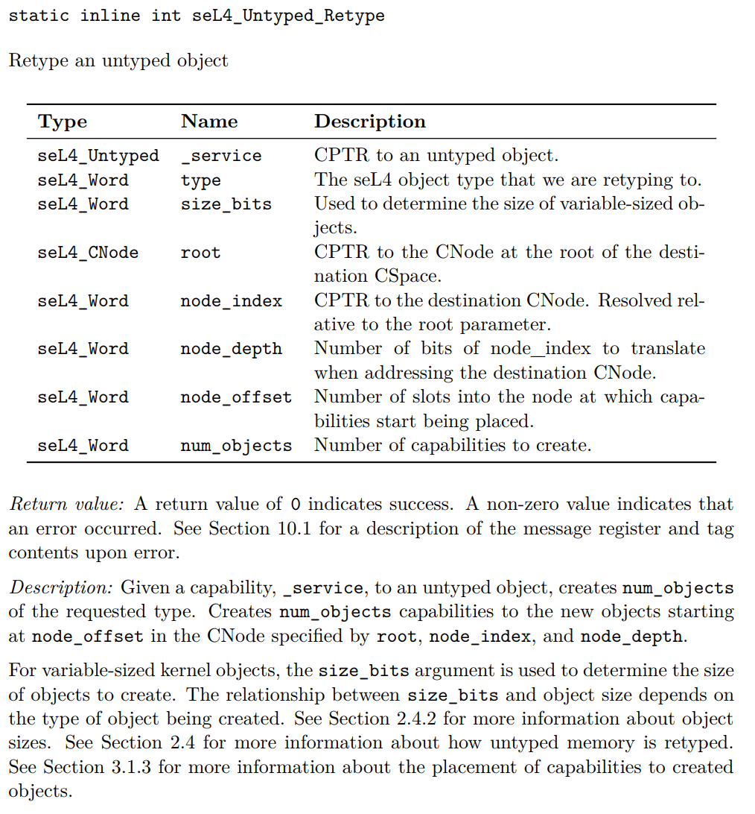

# Untyped
除了一小部分内核相关的内存空间，seL4中所有物理内存由用户级别管理

所有可用的物理内存（untyped memory）的untyped capabilities都交给根任务

## 两种不同类型的memory
untyped memory分为两种（由untyped capability的device字段区分）
1. general purpose untyped
	可以被分配成任何其它object type和使用所有kernel提供
	
2. device untyped
	这是内存空间保留给外设的部分，由硬件平台相关决定。使用受到一定限制。
	- 只能被分配成frame或者其它untyped object
	- 从device untyped分配来的frame也不能用作IPC buffers或者ASID pool
	
是device memory还是general purpose这个属性在分配创建子对象时都会被继承

## memory的使用
### CDT
每创建一个kernel object都会有对应的capability
capability的派生会以capability派生树（capability derivation tree -CDT）的形式体现出来
比如用户用retype untyped memory的方式创建了一个新的kernel object，对应这个kernel object新创建的capability就会插入到CDT中作为untyped memory capability的子capability

更详细的CDT相关放到capability文档那里记录

### watermark
对于每个untyped memory区域，内核会记录watermark用来标记有多少内存已经被分配了，分配内存区域给一个新的object时，会从当前watermark开始分配内存，分配完后watermark值增加上这个object所用内存的大小

### 撤销派生出去的capabilities
介绍一个函数`seL4_CNode_Revoke()`

用在某个capability上时，会递归地删掉所有子capability（结合上述CDT树理解）

Note：用在CDT的叶子节点上，也就是最后一个capability上是，会引发某个为未知对象的销毁。这时如果想想删除一个单一的capability可以使用`seL4_CNode_Delete()`

### Object Sizes
retype untyped memory时要知道object的大小
首先seL4的size_bits都表示对象的大小时2^size_bits（bits）的大小
CNodes, SchedContexts (MCS only，先不用管)和 Untyped Objects 的大小是可变的，当把untyped memory分配为CNode或者把untyped memory划分为更小的Untyped Objects时，`seL4_Untyped_Retype()`这个函数的`size_bits`参数才会起作用
对于其它类型的object，大小是固定的，这个根据平台相关定义在头文件中，`size_bits`这个参数不起作用
其中要注意的是CNode的size_bits表示的是2^size_bits个slots，实际CNode的大小是2^(size_bits + seL4_SlotBits)

## `seL4_Untyped_Retype()`

分析一下这个很常用的函数
参数：
- _service 
	所要使用的untyped object的capability
- type 
	要retype的object类型
- size_bits
	如上述所说，用来指示variable-sized objects（CNode、Untyped Object）的大小
- root
	存放新分配出来的对象的capability的目标CSpace的root，也就是一个CNode的Capability
- node_index
	存放新分配出来的对象的capability的目标CNode的Capability
- node_depth
	Capability寻址位数
- node_offset
	在目标CNode上的第几个CSlot开始放新的Capability
- num_objects
	新创建的capability的数量
	
node_index设为0就表示目标就在当前的CSpace的root CNode上，这时node_depth也不会起作用了
node_index和node_depth是用来多个CSpace多级查找的

