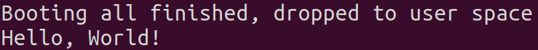
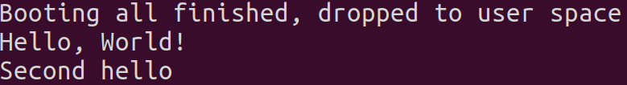

# [2022.3.2 seL4 Tutorials-0.Hello, World!](https://docs.sel4.systems/Tutorials/hello-world.html#prerequisites)
1. 获取seL4教程源码
    ```
    mkdir sel4-tutorials-manifest
    cd sel4-tutorials-manifest
    repo init -u https://github.com/seL4/sel4-tutorials-manifest
    repo sync
    ```

2. 提取hello-world实验代码并编译
    ```
    ./init --tut hello-world
    cd hello-world_build
    ninja
    ```

3. simulate运行hello-world和hello-world-build两个文件夹，hello-world中是实验源码，hello-world-build中是用于编译构建项目的环境

    

    seL4是microkernel，而不是operating system，因此只提供非常少的服务。内核启动后，会启动一个初始化进程root task，负责设置用户级系统环境，此时没有可用的驱动程序，只有一个最小的C库

    补充一下退出qemu虚拟机的方法：ctrl-a松开然后按x

4. 修改hello-world->src->main.c
添加一行代码`printf("Second hello\n");`

5. 重新编译并运行

    
