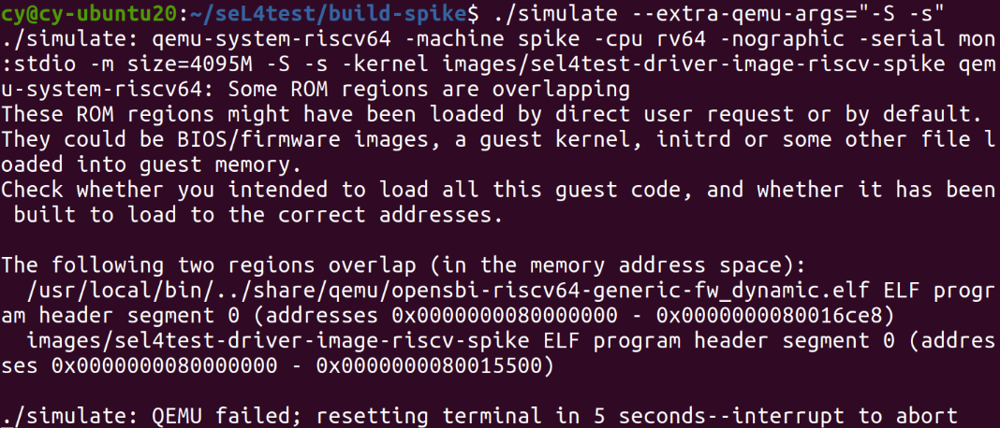

# seL4Test RISC-V qemu模拟

## 安装gcc交叉编译工具链
```
sudo apt-get install gawk
sudo apt-get install texinfo
sudo apt-get install bison
sudo apt-get install flex
git clone https://github.com/riscv/riscv-gnu-toolchain.git
cd riscv-gnu-toolchain
git submodule update --init --recursive
```
配置环境变量
`vim ~/.bashrc`
在末尾加入
```
export RISCV=/opt/riscv
export PATH=$RISCV/bin:$PATH
```
保存后
`source ~/.bashrc`
编译
```
./configure --prefix="${RISCV}" --enable-multilib
sudo make linux
```

中间虚拟机空间又不够了，扩容以后无法启动，还来根据[此](https://post.smzdm.com/p/a5g0ez07/)解决

## 构建运行seL4test
目前RISC-V支持四种平台，只有Spike支持qemu模拟
[seL4支持的硬件平台](https://docs.sel4.systems/Hardware/)
在seL4test目录下
```
mkdir build-spike
cd build-spike
../init-build.sh -DPLATFORM=spike -DRISCV64=1 -DSIMULATION=1
ninja
./simulate
```
中间编译报错多试几次就好了

`./simulate`可以运行，但是要用gdb调试时加上参数`./simulate --extra-qemu-args="-S -s"`就会出现错误





因为缺少了参数，直接用命令` qemu-system-riscv64 -machine spike -cpu rv64 -nographic -serial mon:stdio -m size=4095M -S -s -kernel images/sel4test-driver-image-riscv-spike -bios none`