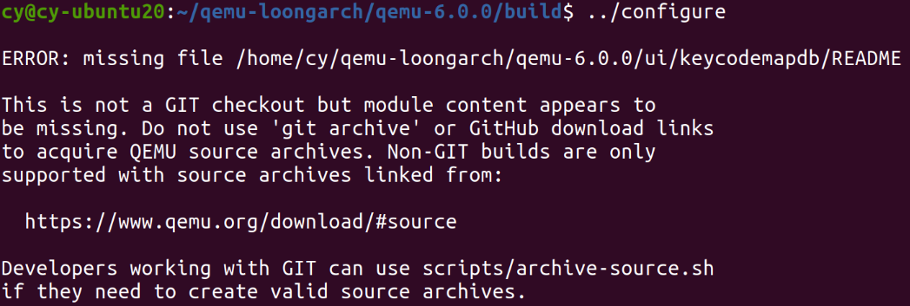
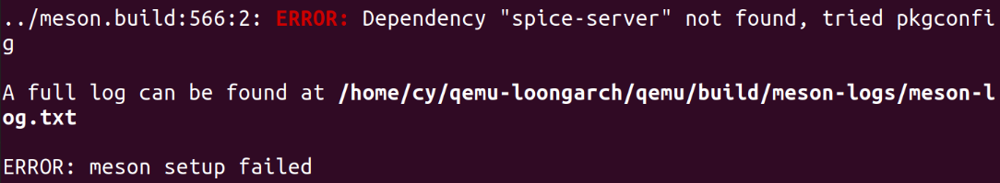
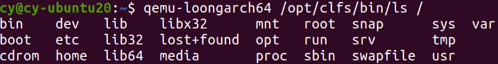
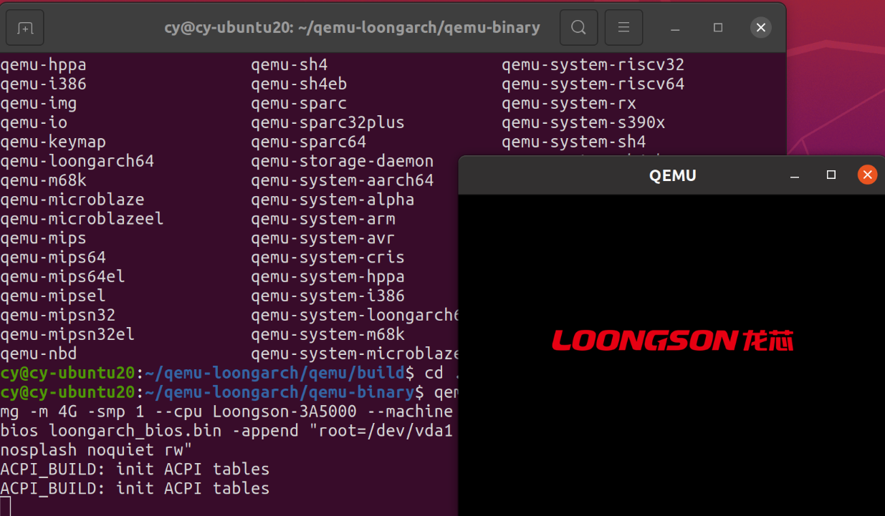
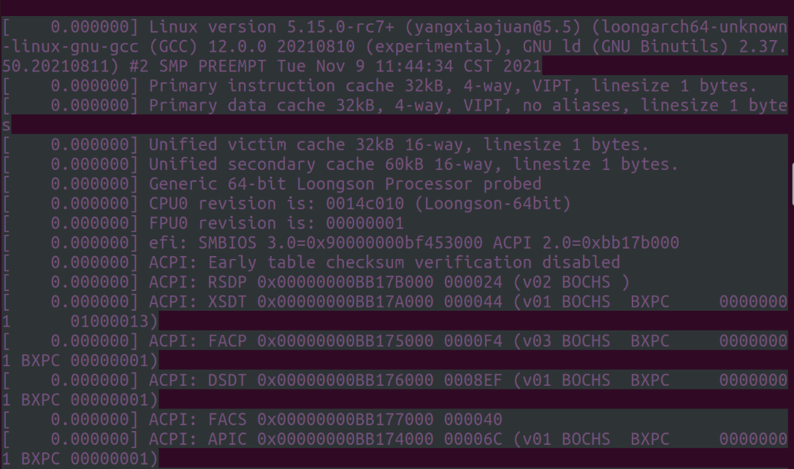

# LoongArch x86交叉编译器安装
1. 下载交叉编译器
	```
	wget https://github.com/loongson/build-tools/releases/latest/download/loongarch64-clfs-20210831-cross-tools.tar.xz
	sudo tar -vxf loongarch64-clfs-20210831-cross-tools.tar.xz -C /opt
	```

2. 配置交叉编译器环境
`vim ~/.bashrc`
文件末尾加入
	```
	CC_PREFIX=/opt/cross-tools
	export PATH=$CC_PREFIX/bin:$PATH
	export LD_LIBRARY_PATH=$CC_PREFIX/lib:$LD_LIBRARY_PATH
	export LD_LIBRARY_PATH=$CC_PREFIX/loongarch64-unknown-linux-gnu/lib/:$LD_LIBRARY_PATH
	```
	保存，运行以下命令使配置文件生效
	`source ~/.bashrc`

# qemu安装
下载安装qemu

`wget https://github.com/loongson/qemu/archive/refs/tags/v6.0.0.tar.gz`

```
mkdir qemu-loongarch
tar -vxf v6.0.0.tar.gz -C qemu-loongarch
cd qemu-loongarch/qemu-6.0.0
mkdir build
cd build
../configure
```
出现问题



换成用git的方式获取源码，tcg-dev这个分支才支持loongarch

`git clone -b tcg-dev https://github.com/yangxiaojuan-loongson/qemu.git`

下载完成后进入qemu目录，运行命令
```
./configure --disable-rdma --disable-pvrdma --prefix=/usr  \
            --target-list="loongarch64-linux-user loongarch64-softmmu"  \
            --disable-libiscsi --disable-libnfs --disable-libpmem \
            --disable-glusterfs --enable-libusb --enable-usb-redir \
            --disable-opengl --disable-xen --enable-spice --disable-werror \
            --enable-debug --disable-capstone --disable-kvm --enable-profiler
```
这里我们关心的参数主要是“--target-list”，通过查看该参数支持的内容会发现，QEMU主要有两种使用方式，分别是：softmmu和linux-user，前者是系统仿真，而后者是linux用户模式仿真，简单的理解就是前面模拟了一台主机，后者模拟了Linux内核环境可以直接运行linux命令



提示缺少依赖
```
wget https://www.spice-space.org/download/releases/spice-protocol/spice-protocol-0.5.2.tar.bz2
tar xjvf spice-protocol-0.5.2.tar.bz2
cd spice-protocol-0.5.2/
./configure
make && make install

wget https://ftp.osuosl.org/pub/xiph/releases/celt/celt-0.5.1.3.tar.gz
tar xzvf celt-0.5.1.3.tar.gz
cd celt-0.5.1.3
./configure
make && make install

apt-get install libssl-dev

wget https://www.spice-space.org/download/releases/spice-server/spice-0.14.2.tar.bz2
tar xjvf spice-0.14.2.tar.bz2
cd spice-0.14.2/
./configure --enable-celt051 --disable-opus
make && make install

apt-get install libusbredirparser-dev
apt-get install libusb-1.0-0
```

重新configure qemu，进入qemu的build目录
```
cd build
make -j8 && make check-tcg
```

# 下载安装loongarch-clfs-system
1. 下载clfs-system
	```
	wget https://github.com/loongson/build-tools/releases/latest/download/loongarch64-clfs-system-2021-08-31.tar.bz2
	sudo mkdir /opt/clfs
	sudo tar -vxf loongarch64-clfs-system-2021-08-31.tar.bz2 -C /opt/clfs
	```

2. 配置环境
	```
	sudo cp /opt/clfs/lib64/ld-linux-loongarch64.so.1   /lib64
	export LD_LIBRARY_PATH="/opt/clfs/lib64"
	```

# 用户模式仿真（linux-user）
列出当前系统根目录的内容


# 系统仿真（softmmu）

[vmlinux, ramdisk and uefi](https://github.com/yangxiaojuan-loongson/qemu-binary)

[张老师做的img，代替上面的ramdisk](ftp://182.92.153.183/uploads/qemu/clfs.img.xz)

[模拟器启动参数参看这里](ftp://182.92.153.183/uploads/qemu/run-clfs.sh)
```
emu-system-loongarch64 -hda clfs.img -m 4G -smp 1 --cpu Loongson-3A5000 --machine loongson3-ls7a -kernel vmlinux -bios loongarch_bios.bin -append "root=/dev/vda1 console=ttyS0,115200 loglevel=7 nosplash noquiet rw"
```


图形界面暂时进不去系统

加上 --nographic参数
```
emu-system-loongarch64 -hda clfs.img -m 4G -smp 1 --cpu Loongson-3A5000 --machine loongson3-ls7a -kernel vmlinux -bios loongarch_bios.bin -append "root=/dev/vda1 console=ttyS0,115200 loglevel=7 nosplash noquiet rw" --nographic
```





	


