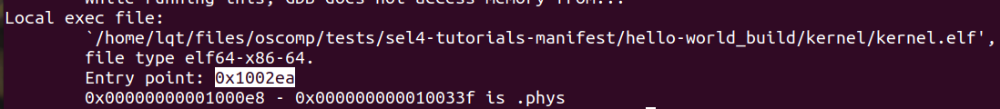

# porting

seL4网站：[Porting seL4 to a new platform ](https://docs.sel4.systems/projects/sel4/porting)。

FAQ：[Frequently Asked Questions on seL4 ](https://docs.sel4.systems/projects/sel4/frequently-asked-questions.html)。

[Tutorials | seL4 docs](https://docs.sel4.systems/Tutorials/)。感觉这里面的seL4 mechanisms tutorials有点用。

libsel4 API：[API Reference | seL4 docs](https://docs.sel4.systems/projects/sel4/api-doc.html)。

知乎博客：https://zhuanlan.zhihu.com/p/466424606。

csdn博客：[sel4源码解析（一） - sel4内核对象_Mr0cheng的专栏-CSDN博客_sel4内核](https://blog.csdn.net/Mr0cheng/article/details/104338058)。

## Porting seL4 to a new platform

根据网页：[Porting seL4 to a new platform ](https://docs.sel4.systems/projects/sel4/porting)。

tree命令，将当前目录打印到某文件。

```
tree [-L n]> fileTree.txt #-L n为限制层级，e.g.-L 2，重定向输出至fileTree.txt
```

根目录：

```
.
├── build
├── CAVEATS-generic.md
├── CAVEATS-ia32.md
├── CHANGES
├── CMakeLists.txt
├── CODE_OF_CONDUCT.md
├── config.cmake
├── configs
├── CONTRIBUTING.md
├── CONTRIBUTORS.md
├── FindseL4.cmake
├── gcc.cmake
├── gdb-macros
├── include
├── libsel4 #libsel4/sel4_plat_include/<platform>/sel4/plat/api/constants.h
├── LICENSE.md
├── LICENSES
├── llvm.cmake
├── manual
├── README.md
├── src
├── tools
├── treefile.txt
└── VERSION
```

* DTS修改：在tools/dts/update-dts.sh
* Hardware generation script修改：在tools/hardware.yml
  * Drivers：/src/drivers/
  * Drivers：/include/drivers/
* kernel：在libsel4/sel4_plat_include/\<platform>/sel4/plat/api/constants.h添加支持

* CMake-Build System：在kernel/src/plat/\<platform>/config.cmake，以及tools/seL4/cmake-tool/helpers/application_settings.cmake，还有tools/seL4/elfloader-tool/CMakeLists.txt
* elf-loader：在tools/seL4/elfloader-tool/src/plat/\<platform>/sys_fputc.c，以及tools/seL4/elfloader-tool/include/plat/\<platform>/platform.h
* seL4test：在sel4test/projects/util_libs/libplatsupport/plat_include/\<platform>/platsupport/plat下添加头文件支持，在sel4test/projects/util_libs/libplatsupport/src/plat/\<platform>/下添加相应源文件。

# tutorials部分

参考网址：[Tutorials | seL4 docs](https://docs.sel4.systems/Tutorials/)。

先建立文件夹：

```
mkdir sel4-tutorials-manifest
cd sel4-tutorials-manifest
repo init -u https://github.com/seL4/sel4-tutorials-manifest
repo sync
```

在文件夹下，输入如下命令，查看相应的内容，选择参数，自动生成文件。

```
./init -h
```

例如：

```
./init --tut hello-world # 自动生成hello-world，hello-world_build
cd hello-world
ninja
./simulate
```

vscode跳转到上次位置：`shift+alt+-`

## helloworld

```
./simulate --extra-qemu-args="-s -S"
```

好像不能直接读入两个符号表。启动gdb 读入kernel的符号表：

```
gdb kernel/kernel.elf
target remote:1234
```

获取程序入口信息，设置断点

```
info files
```



设置断点：

```
b *0x1002ea
```

另外，保存断点：

```
save breakpoint ${BPfilename}
```

下次调试文件时，在指定文件的同时，指定断点文件

```
gdb ${filename} -X ${BPfilename}
```

汇编好像用的AT&T语法。[汇编中 $ 和 % 符号的作用-andyhzw-ChinaUnix博客](http://blog.chinaunix.net/uid-28458801-id-3555479.html)。

AT&T语法中，$表示立即数，%表示寄存器。mov $4, %eax，是把4送入eax。


## capability

Capabilities：类似于句柄？

CNodes：类似于capabilities的数组？

CSlots：类似于CNodes中每个元素指针？

CSpace：属于一个线程的capability地址范围。根任务总是有一个指向CNode的root Capability，可以利用root capability查找对应CSlot中指向的capability。


## Untyped

### Background

启动阶段创建对象的cap，以及其他物理资源，在启动时会传递给root task

除了用来创建根任务的cap，指向其他可得物理资源的cap会传递给root task，这些cap指向的是untyped memory。无类型cap是指向无类型内存的cap。无类型cap可以重新指向内核其他对象，或者更小的无类型内存。

device：boolean类型的属性，指示内存是否可被内核写，这片内存可能不由ram设备支持而是其他设备支持的内存，或者是ram内无法由内核寻址的空间。device为true的无类型cap只能重新指向帧对象（可以被映射到虚拟内存的物理内存帧），但是不能被内核写。

### Initial state

seL4_BootInfo描述所有无类型cap，提供给root task，包括大小，device untyped？以及物理地址。

### Retyping

 seL4_Untyped_Retype，可以用来创建新的cap。创建出来的新cap提供对原cap内存子区域的访问，要么是更小区域无类型cap，要么是指向特定类型的新对象cap。新cap是原cap的children。

无类型cap以贪心的增量方式retype，这有助于内存的高效利用。每个无类型cap维护一个watermark，watermark包含retype前的地址和retype开始时的地址。在retype时候，watermark首先是对象的对其地址，最后是末地址。创建对象要按照占据内存从大到小排序创建。


#### Types

libsel4下，可以找到对象的类型的描述。有些是架构特有的，其他的是各个架构都有的。然后讲了上面函数的内容。

#### Size

该函数的size参数的一些情况：

* 多数对象都是固定的size，内核忽略改参数。
* seL4_UntypedObject 和seL4_SchedContextObject允许可变size，由参数指定。2的size次方。
* seL4_CapTableObject 也是可变size，改参数是slot数量。

`For retype, it is enough to remember that the parameter size_bits means the object will measure 2size_bits bytes, and for seL4_CapTableObject that you are requesting 2size_bits slots (you can compute the size in bytes by taking 2size_bits + seL4_SlotBits`

#### Root, node_index & node_depth

node_depth设为0，意味着invocation方式寻址。index忽略。

node_depth不设为0，直接寻址。当前线程的scpace root作为root，index指向CNode，depth是index指向CNode的大小。为多层cspace设计的。

#### Node_offset

CNode中选的CSlot偏移

#### Num_caps

该函数可以创建多个cap和object。

注意：untyped必须足够大来装入所有需要的内存。要有连串的空闲CSlot放cap。


