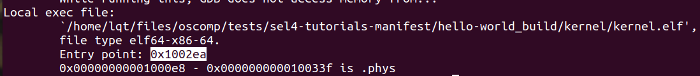

# porting

seL4网站：[Porting seL4 to a new platform ](https://docs.sel4.systems/projects/sel4/porting)。

FAQ：[Frequently Asked Questions on seL4 ](https://docs.sel4.systems/projects/sel4/frequently-asked-questions.html)。

[Tutorials | seL4 docs](https://docs.sel4.systems/Tutorials/)。感觉这里面的seL4 mechanisms tutorials有点用。

libsel4 API：[API Reference | seL4 docs](https://docs.sel4.systems/projects/sel4/api-doc.html)。

知乎博客：https://zhuanlan.zhihu.com/p/466424606。

csdn博客：[sel4源码解析（一） - sel4内核对象_Mr0cheng的专栏-CSDN博客_sel4内核](https://blog.csdn.net/Mr0cheng/article/details/104338058)。

## Porting seL4 to a new platform

根据网页：[Porting seL4 to a new platform ](https://docs.sel4.systems/projects/sel4/porting)。

tree命令，将当前目录打印到某文件。

```
tree [-L n]> fileTree.txt #-L n为限制层级，e.g.-L 2，重定向输出至fileTree.txt
```

根目录：

```
.
├── build
├── CAVEATS-generic.md
├── CAVEATS-ia32.md
├── CHANGES
├── CMakeLists.txt
├── CODE_OF_CONDUCT.md
├── config.cmake
├── configs
├── CONTRIBUTING.md
├── CONTRIBUTORS.md
├── FindseL4.cmake
├── gcc.cmake
├── gdb-macros
├── include
├── libsel4 #libsel4/sel4_plat_include/<platform>/sel4/plat/api/constants.h
├── LICENSE.md
├── LICENSES
├── llvm.cmake
├── manual
├── README.md
├── src
├── tools
├── treefile.txt
└── VERSION
```

* DTS修改：在tools/dts/update-dts.sh
* Hardware generation script修改：在tools/hardware.yml
  * Drivers：/src/drivers/
  * Drivers：/include/drivers/
* kernel：在libsel4/sel4_plat_include/\<platform>/sel4/plat/api/constants.h添加支持

* CMake-Build System：在kernel/src/plat/\<platform>/config.cmake，以及tools/seL4/cmake-tool/helpers/application_settings.cmake，还有tools/seL4/elfloader-tool/CMakeLists.txt
* elf-loader：在tools/seL4/elfloader-tool/src/plat/\<platform>/sys_fputc.c，以及tools/seL4/elfloader-tool/include/plat/\<platform>/platform.h
* seL4test：在sel4test/projects/util_libs/libplatsupport/plat_include/\<platform>/platsupport/plat下添加头文件支持，在sel4test/projects/util_libs/libplatsupport/src/plat/\<platform>/下添加相应源文件。

# tutorials部分

参考网址：[Tutorials | seL4 docs](https://docs.sel4.systems/Tutorials/)。

先建立文件夹：

```
mkdir sel4-tutorials-manifest
cd sel4-tutorials-manifest
repo init -u https://github.com/seL4/sel4-tutorials-manifest
repo sync
```

在文件夹下，输入如下命令，查看相应的内容，选择参数，自动生成文件。

```
./init -h
```

例如：

```
./init --tut hello-world # 自动生成hello-world，hello-world_build
cd hello-world
ninja
./simulate
```

vscode跳转到上次位置：`shift+alt+-`

## helloworld

```
./simulate --extra-qemu-args="-s -S"
```

好像不能直接读入两个符号表。启动gdb 读入kernel的符号表：

```
gdb kernel/kernel.elf
target remote:1234
```

获取程序入口信息，设置断点

```
info files
```



设置断点：

```
b *0x1002ea
```

另外，保存断点：

```
save breakpoint ${BPfilename}
```

下次调试文件时，在指定文件的同时，指定断点文件

```
gdb ${filename} -X ${BPfilename}
```

汇编好像用的AT&T语法。[汇编中 $ 和 % 符号的作用-andyhzw-ChinaUnix博客](http://blog.chinaunix.net/uid-28458801-id-3555479.html)。

AT&T语法中，$表示立即数，%表示寄存器。mov $4, %eax，是把4送入eax。


## capability

Capabilities：类似于句柄？

CNodes：类似于capabilities的数组？

CSlots：类似于CNodes中每个元素指针？

CSpace：属于一个线程的capability地址范围。根任务总是有一个指向CNode的root Capability，可以利用root capability查找对应CSlot中指向的capability。


## Untyped

### Background

启动阶段创建对象的cap，以及其他物理资源，在启动时会传递给root task

除了用来创建根任务的cap，指向其他可得物理资源的cap会传递给root task，这些cap指向的是untyped memory。无类型cap是指向无类型内存的cap。无类型cap可以重新指向内核其他对象，或者更小的无类型内存。

device：boolean类型的属性，指示内存是否可被内核写，这片内存可能不由ram设备支持而是其他设备支持的内存，或者是ram内无法由内核寻址的空间。device为true的无类型cap只能重新指向帧对象（可以被映射到虚拟内存的物理内存帧），但是不能被内核写。

### Initial state

seL4_BootInfo描述所有无类型cap，提供给root task，包括大小，device untyped？以及物理地址。

### Retyping

 seL4_Untyped_Retype，可以用来创建新的cap。创建出来的新cap提供对原cap内存子区域的访问，要么是更小区域无类型cap，要么是指向特定类型的新对象cap。新cap是原cap的children。

无类型cap以贪心的增量方式retype，这有助于内存的高效利用。每个无类型cap维护一个watermark，watermark包含retype前的地址和retype开始时的地址。在retype时候，watermark首先是对象的对其地址，最后是末地址。创建对象要按照占据内存从大到小排序创建。


#### Types

libsel4下，可以找到对象的类型的描述。有些是架构特有的，其他的是各个架构都有的。然后讲了上面函数的内容。

#### Size

该函数的size参数的一些情况：

* 多数对象都是固定的size，内核忽略改参数。
* seL4_UntypedObject 和seL4_SchedContextObject允许可变size，由参数指定。2的size次方。
* seL4_CapTableObject 也是可变size，改参数是slot数量。

`For retype, it is enough to remember that the parameter size_bits means the object will measure 2size_bits bytes, and for seL4_CapTableObject that you are requesting 2size_bits slots (you can compute the size in bytes by taking 2size_bits + seL4_SlotBits`

#### Root, node_index & node_depth

node_depth设为0，意味着invocation方式寻址。index忽略。

node_depth不设为0，直接寻址。当前线程的scpace root作为root，index指向CNode，depth是index指向CNode的大小。为多层cspace设计的。

#### Node_offset

CNode中选的CSlot偏移

#### Num_caps

该函数可以创建多个cap和object。

注意：untyped必须足够大来装入所有需要的内存。要有连串的空闲CSlot放cap。

### 一些问题

 tut代码中， seL4_Untyped_Retype(child_untyped, seL4_TCBObject, 0, seL4_CapInitThreadCNode, 0, 0, child_tcb, 1);

为啥是CapInitThreadCNode？初始化时候，还没有创建其他线程。

## Virtual memory

[地址映射_zyn19950120的博客-CSDN博客_地址映射](https://blog.csdn.net/zyn19950120/article/details/77647761?spm=1001.2101.3001.6650.1&utm_medium=distribute.pc_relevant.none-task-blog-2~default~CTRLIST~Rate-1.pc_relevant_default&depth_1-utm_source=distribute.pc_relevant.none-task-blog-2~default~CTRLIST~Rate-1.pc_relevant_default&utm_relevant_index=2)。

[C语言字节对齐详解_OopspoO的博客-CSDN博客_字节对齐](https://blog.csdn.net/cclethe/article/details/79659590)。

### Background

seL4不提供虚拟内存管理，除了用来操作硬件分页结构的内核原语。**用户提供中间分页结构、映射和取消映射页面的服务。**

用户可自由定义地址空间布局，遵守限制：`On most 32-bit platforms, this is 0xe0000000 and above`，kernelBase变量。

### Paging structures

VSpace：根任务初始化时候的虚拟存储对象。由seL4_CapInitThreadVSpace指向该结构。各种arch下的object type不同。它是top-level的。


除了top-level的，中间硬件虚拟存储对象也被用来映射页。


可以通过调用来确定是否映射。`seL4_X86_PDPT_Map(pdpt, seL4_CapInitThreadVSpace, TEST_VADDR, seL4_X86_Default_VMAttributes)`该函数的三个参数：VSpace，vaddr，vattributes，第一个参数是被映射的对象。vattributes是映射时高速缓存的属性，与架构相关，libsel4中可以看到。


如果虚拟地址参数与映射对象大小不是对齐的，seL4将会mask out任何未使用的位。例如4KB的页被映射到0xDEADBEEF，最终会被映射到0xDEADB000。

### Pages

对于特定的虚拟地址range，一旦所有的中间映射结构被设计好，通过调用帧的cap，该帧就可以被映射进去了。代码片段展示了将frame映射到test_vaddr。


libsel4中的函数seL4_MappingFailedLookupLevel决定哪一级映射结构缺失。多级映射，每一级要有一个cap，每个cap只能追踪一级映射。上面函数中还有个rights参数，它决定着映射权限。

#### Types and sizes

页类型和数量与架构有关。x86和ARM架构上，各个size的页类型不同。在RISCV上，页类型相同但大小不尽相同。通过改变配置来改变页大小。

### 疑问

mapping里涉及的几个参数是怎么理解？
pdpt是“pd的目录”的cap吗，对应seL4_X86_PDPT_Map
pd是pd的cap，对应seL4_X86_PageDirectory_Map
pt是pt的cap，对应seL4_X86_PageTable_Map
具体页cap，对应seL4_X86_Page_Map

## Threads

### Background

#### TCB

sel4用线程来表示执行上下文并管理处理器时间。sel4中的线程由线程控制块TCB对象实现，每个线程有个线程控制块。

TCB包含如下信息：

* 优先级别以及最大控制优先级
* 寄存器状态和浮点上下文
* cspace 的cap
* vsapce 的cap
* 端点cap，用于发送错误消息
* reply cap，回复cap？

#### Scheduling model

sel4调度器调度thread到某个处理器上运行，调度算法是基于优先级的round-robin调度。调度器会选择可以运行的threads，基于这样的条件：在任何IPC操作上不会被阻止并可以恢复。

##### Priorities

0-255的优先级，调度器选择最高的优先级。libsel4中有编码。kernel/libsel4/include/sel4/constants.h。

TCB还有个MCP属性。设置TCB优先级的时候，必须准确提供tcb的cap。优先级由tcb的mcp检查，如果被设置的优先级过高，就设置失败。根任务最初的priority和MCP都设为seL4_MaxPrio。

##### Round robin时间片轮转

多个tcb可以运行，优先级相同时，它们以先进先出的round-robin方式被调度。内核时间按照固定时间量tick的数量来计算。tcb有个时间片字段，表示被抢占前可以执行的tick数。内核时间驱动，被配置为出发周期性中断的方式，中断会标记每个tick。当时间片耗尽时，该算法起作用。thread通过seL4_Yield放弃当前的时间片占用。

##### Domain scheduling

为了保证机密性，sel4提供了顶级分层调度程序，它能够提供调度分区(即域)的静态调度，周期性调度。在编译时，域将被静态配置为不可抢占式的周期性调度，这会导致完全确定性的调度。

线程可以被分配进域，线程只有在域活跃时才会被调度。跨域的IPC需要等待域切换完成，域间的seL4_Yield不被允许。假如调度了域，但是域内没有运行thread，域内特定的空闲线程将运行直到发生域切换。

通过seL4_DomainSet cap，将thread加入domain。

#### Thread Attributes

sel4线程在tcb的invocation中被配置。

### Exercise

#### CapDL Loader

之前的tutorials都在根任务中，起始scpace布局是由sel4 boot 程序设置的。这个教程使用capDL loader，它是分配静态配置对象和cap的root task。

capDL loader能够解析对系统和相关elf二进制文件的静态描述，从而分配静态配置对象和cap。它主要用于camkes项目也用于教程减少冗余代码。你创建的程序最终会有它自己的cspace和vspace，它们与root task是分开的，这意味着seL4_CapInitThreadVSpace这样的cslot在capDL loader加载的程序中是无意义的。

#### Configure a TCB

debug syscalls在libsel4中可以找到。seL4_DebugDumpScheduler()可以转储调度器的状态。

问题：


看注释里说这是current thread的root_cnode和root_vspace。不是创建了一个新的tcb么，不用新指定root_cnode吗？还是说，这是子线程关系，所以用的父线程一样的root_cnode?--应该是


另外，内核启动以后，未创建新线程前，不是只有一个线程么，这里有rootserver和idle可以理解，为啥还有tcb_threads线程？

试了下helloworld，确实只有2个：


即从helloworld里打印是没有的，搜了一下，感觉是某处创建了这个线程。

#### Change priority via seL4_TCB_SetPriority

新建线程的priority为0，


