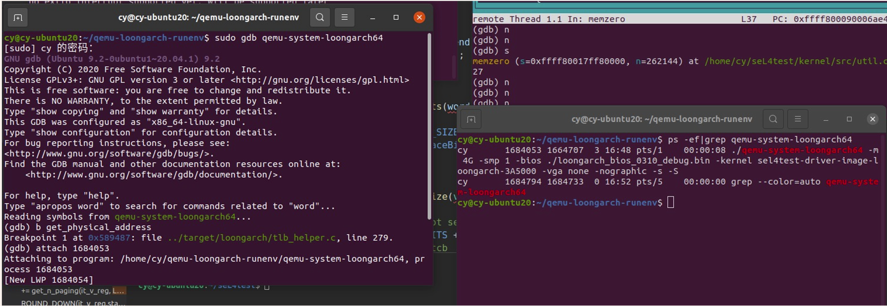
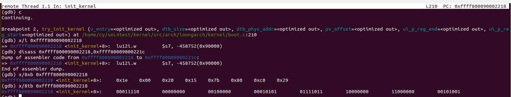

# 关于debug版本的qemu获取方法：

拉取qemu，替换改动的文件，编译出debug版本。

# 关于调试qemu-system-loongarch64方法

先连上被调试的kernel，target remote：1234。

然后连上debug版本的qemu，查看qemu的进程号，然后本地管理员gdb调试qemu，输入进程号并连接。给qemu打上断点直接c，再回去运行kernel。

# 其它方便的指令。

# 内联汇编的调试

nexti和stepi可以单步机器指令，即ni和si，前者不进入函数，类似于n指令。

stepi结合内存地址查看，每条指令的地址间隔应该是指令的长度。

多放几个label，在汇编中label即有地址，直接**break到label**。

## x/ 查看内存

x $pc

x/10i $pc，查看当前位置往后的10条汇编指令

(gdb) x /wx 0x80040000 # 以16进制显示指定地址处的数据
(gdb) x /8x $esp
(gdb) x /16x $esp+12
(gdb) x /16s 0x86468700 # 以字符串形式显示指定地址处的数据
(gdb) x /24i 0x8048a51 # 以指令形式显示指定地址处的数据（24条）

## i 查看寄存器

i r
i r a # 查看所有寄存器（包括浮点、多媒体）
i r esp
i r pc'

## p查看变量值

如果是结构体也可以显示

如果是指针变量可以用*

# tui界面的快捷键

ctrl+p 上一条指令

ctrl+n 下一条指令

# 切换调试汇编和源程序

layout asm 切换到asm调试

layout src 切换到源程序视图调试

# 添加符号文件

add-symbol-file [filename]

qemu参数

-d mmu,int,... 在log.c中有选项可以查看

